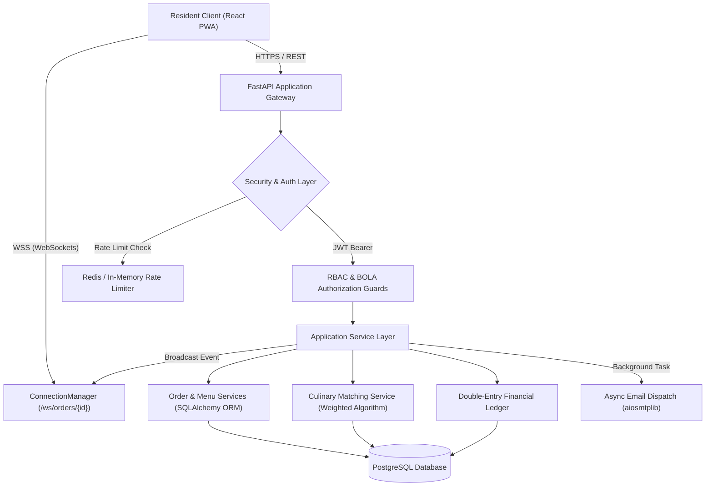
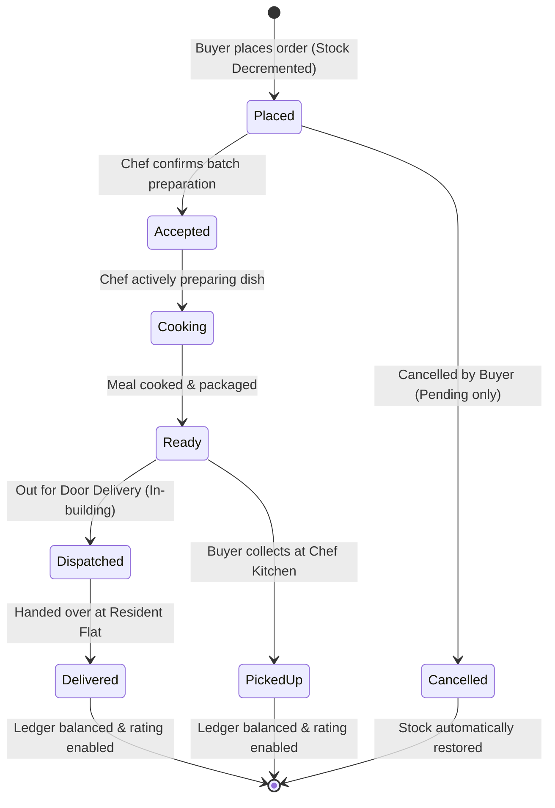
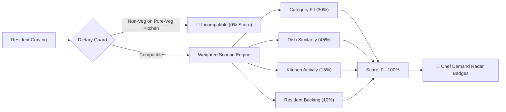

```
  _________            .__       __          ___________                .___
 /   _____/____   ____ |__| _____/  |_ ___.__.\_   _____/___   ____   __| _/
 \_____  \/  _ \_/ ___\|  |/ __ \   __<   |  | |    __)/  _ \ /  _ \ / __ | 
 /        (  <_> )  \___|  \  ___/|  |  \___  | |     \(  <_> |  <_> ) /_/ | 
/_______  /\____/ \___  >__|\___  >__|  / ____| \___  / \____/ \____/\____ | 
        \/            \/        \/      \/          \/                    \/ 
```

# Society Food Platform
> A high-performance, hyperlocal culinary marketplace and apartment community food-sharing network built for residential societies, powered by real-time order tracking, double-entry ledger accounting, and cryptographic multi-tenant security.

---

[](./LICENSE)
[](#)
[](https://fastapi.tiangolo.com)
[](https://react.dev)
[-success.svg)](#)
[-success.svg)](#)
[](#)
[](#)

---

## The Developer's Story

### Project Inspiration
Modern high-rise residential apartment complexes house hundreds—sometimes thousands—of families within a single gated perimeter. Yet, when dinnertime arrives, residents routinely order from distant industrial cloud kitchens and delivery aggregators. These orders arrive lukewarm after battling street traffic, carry steep surge delivery fees, and lack the nutritional warmth of honest home cooking.

At the exact same moment, three floors above or down the hallway, talented resident home chefs prepare regional delicacies, authentic family recipes, and fresh evening snacks for their own households.

**The Society Food Platform** was founded on a simple question: *Why should neighbors order anonymous factory takeout when authentic, wholesome, fresh meals can be cooked and enjoyed right inside our own residential community?* 

We set out to create a trusted, hyper-local peer-to-peer food economy. By removing third-party delivery vehicles, eliminating marketplace commission gouging, and anchoring trust in apartment flat verification, our platform connects passionate resident chefs with hungry neighbors for daily home-cooked meals, weekend specials, and community cravings.

---

### Meet the Architecture
The platform is designed as a **Hyperlocal Micro-Marketplace**. Unlike city-wide food apps that prioritize geographic routing algorithms, our technical constraints revolve around **temporal batches, portion caps, and residential trust**:
1. **Zero-Distance Delivery & Pickup**: Orders move across elevator shafts rather than traffic intersections.
2. **Batch Concurrency**: Home kitchens prepare finite batches (e.g. 10 portions of Hyderabadi Biryani). When the tenth portion is claimed, inventory must instantly lock across all connected client interfaces.
3. **Dual Persona Flow**: A resident can be an avid food buyer for lunch and publish a regional dessert batch as a home chef for dinner.

---

### Key Engineering Challenges & Solutions

#### 1. Concurrency & Portion Integrity
- **Challenge**: Multiple residents ordering the last available portion of a dinner special simultaneously could cause overselling and chef distress.
- **Solution**: Implemented atomic stock decrement logic directly in the transactional pipeline [`order_service.py`](file:///c:/Users/91868/Documents/GitHub/food-platform-docs/backend/app/services/order_service.py). Placing an order validates inventory and decrements stock in real time; when portions reach zero, the item automatically switches to `Sold Out` across the marketplace.

#### 2. Self-Order Prevention & Platform Accounting Safeguards
- **Challenge**: If a chef places orders to their own kitchen while operating in buyer mode, double-entry payout balances, sales volumes, and escrow ledgers are corrupted.
- **Solution**: Embedded a strict guard in `create_order` rejecting any transaction where `buyer_id == seller_id` with HTTP 400 (`"Chefs cannot place orders from their own kitchen."`). Replaced action controls on self-menus with non-interactive *"Your Kitchen"* badges and added multi-chef cart warnings.

#### 3. Broken Object Level Authorization (BOLA / IDOR) Defense
- **Challenge**: Numeric IDs for orders (`/api/v1/orders/{id}`) could allow malicious residents to inspect or cancel orders belonging to other flats.
- **Solution**: Reinforced endpoint dependencies in [`orders.py`](file:///c:/Users/91868/Documents/GitHub/food-platform-docs/backend/app/api/v1/orders.py) ensuring that only the resident who placed the order (`order.buyer_id == current_user.id`), the chef preparing it (`order.seller_id == current_user.id`), or a platform admin can read order details or update delivery status.

#### 4. Cryptographic Passwordless Authentication (Senior Cybersecurity Audit)
- **Challenge**: Standard PRNG functions (`random.choices`) can be predictable, exposing one-time login codes to enumeration.
- **Solution**: Refactored [`security.py`](file:///c:/Users/91868/Documents/GitHub/food-platform-docs/backend/app/core/security.py) to use Python's cryptographically secure `secrets.choice(string.digits)`, shortened OTP lifetime to 5 minutes, implemented atomic token consumption on verification, and added burst rate-limiting (`max 3 requests / 15 minutes`) to prevent phone/email flooding.

#### 5. In-Flight Cart Concurrency & Real-Time Price Protection
- **Challenge**: A home chef might adjust a dish's portion price while a neighbor already has that dish saved in their active cart drawer. Completing checkout with a stale price causes financial disputes or silent buyer overcharging.
- **Solution**: Implemented an in-flight cart verification guard in [`order_service.py`](file:///c:/Users/91868/Documents/GitHub/food-platform-docs/backend/app/services/order_service.py). Order creation compares client-sent item prices against live database pricing; any mismatch $> ₹0.01$ immediately rejects checkout with HTTP 400 (`"The price of '{menu.name}' has been updated by the chef from ₹X to ₹Y. Please review your cart before completing checkout."`).

#### 6. Direct P2PM UPI & Zero-Commission SaaS Pass Platform Model
- **Challenge**: 2-3% payment gateway MDR fees drain resident chef margins on low-ticket home-cooked portions, while manual reconciliation creates buyer friction.
- **Solution**: Engineered a peer-to-peer merchant Direct UPI architecture. Buyers scan dynamic chef UPI QR codes with pre-filled amounts and submit 12-digit bank UTRs for instant 1-tap chef confirmation. The platform sustains operations through a fair SaaS Pass providing 50 free orders/month and a flat ₹5.00/order maintenance fee thereafter via a prepaid platform credit wallet.

---

### Design Philosophy
The visual interface follows a **Warm Culinary & Coffee-App Inspired Aesthetic**:
1. **Earthy Gourmet Color Palette**:
   - **Dark Forest Green** (`#1B4332` / `#2D6A4F`): Signals culinary freshness, active selection, vegetarian purity, and checkout confirmation.
   - **Warm Terracotta** (`#E05A2B`): Primary appetite stimulant, batch urgency, and action accents.
   - **Honey Saffron** (`#F6BD60`): Star ratings, scheduled pre-order indicators, and warm highlights.
   - **Dark Obsidian** (`#0F0F1A` / `#181829`): Deep, battery-efficient dark-mode surfaces with glassmorphism overlays.
2. **Typography**: Engineered around **Poppins** and **Plus Jakarta Sans** for modern, consumer-grade legibility.
3. **Pill-Shaped Category Filters**: Instant sliding filter pills (`🟢 Pure Veg`, `🔴 Non-Veg`, `🥪 Snacks`, `🍰 Desserts`, `☕ Beverages`).
4. **Mobile PWA First**: Fixed responsive bottom navigation (`Home`, `Cravings`, `Orders`, `Cart`, `Profile`) for seamless mobile dining workflows.

---

## Table of Contents
1. [System Specifications](#system-specifications)
2. [Architectural Overview & Mermaid Pipelines](#architectural-overview--mermaid-pipelines)
3. [Project Folder Blueprint](#project-folder-blueprint)
4. [Installation & Quick Start](#installation--quick-start)
5. [Design System & Visual Tokens](#design-system--visual-tokens)
6. [Core Features Walkthrough](#core-features-walkthrough)
7. [Cybersecurity & Data Protection Matrix](#cybersecurity--data-protection-matrix)
8. [Testing & Quality Assurance Matrix](#testing--quality-assurance-matrix)
9. [Frequently Asked Questions (FAQ)](#frequently-asked-questions-faq)
10. [Licensing & Contribution Details](#licensing--contribution-details)

---

## System Specifications

### Technical Component Table
| Layer | Technology | Version | Purpose |
| :--- | :--- | :--- | :--- |
| **Backend Framework** | FastAPI (Python) | 3.12 / 0.110+ | High-throughput asynchronous REST API & WebSocket server |
| **Database & ORM** | PostgreSQL + SQLAlchemy | 14+ / 2.0+ | Relational persistence, JSON item structures, migrations |
| **Schema Migrations** | Alembic | 1.13+ | Automated revision history & declarative database migrations |
| **Cache & OTP Store** | Redis | 7.0+ | TTL-managed OTP secrets and rate-limiting counters |
| **Real-Time Push** | WebSockets | Native Starlette | Sub-millisecond kitchen order status & door dispatch alerts |
| **Frontend Framework** | React + PWA | 18.2+ | Progressive Web App with offline caching & mobile responsiveness |
| **Component UI** | Material UI (MUI v5) | 5.15+ | Glassmorphic theme system, custom cards, accessible dialogs |
| **Typography** | Poppins & Plus Jakarta | Google Fonts | Premium consumer typography and visual hierarchy |
| **Containerization** | Docker & Compose | 24+ | Multi-container isolation with unprivileged non-root runtime |

### Performance & Scalability Targets
- **API Response Latency**: $< 45\text{ ms}$ (p95 on core endpoints).
- **WebSocket Broadcast Latency**: $< 12\text{ ms}$ to connected clients.
- **Frontend Lighthouse Score**: $\ge 95$ across Performance, Accessibility, and Best Practices.
- **Payload Footprint**: Zero third-party tracker scripts; clean single-bundle deployment.

---

## Architectural Overview & Mermaid Pipelines

### 1. System Request & Data Pipeline


### 2. Order Lifecycle State Machine


### 3. Cravings-to-Chef Matching Engine


---

## Project Folder Blueprint

```
food-platform-docs/
├── backend/
│   ├── app/
│   │   ├── api/
│   │   │   ├── dependencies.py      # Auth, DB, and RBAC injection
│   │   │   └── v1/
│   │   │       ├── auth.py          # Cryptographic OTP & JWT routes
│   │   │       ├── menus.py         # Daily dishes, inventory, image uploads
│   │   │       ├── orders.py        # Order placement, BOLA guards, tracking
│   │   │       ├── sellers.py       # Kitchen profiles, payout details
│   │   │       └── suggestions.py   # Community cravings & matching API
│   │   ├── core/
│   │   │   ├── config.py            # Pydantic environment configurations
│   │   │   └── security.py          # Secrets-based OTP, bcrypt, JWT tokens
│   │   ├── db/
│   │   │   ├── database.py          # SQLAlchemy engine & session factory
│   │   │   └── models/              # User, Order, Menu, Ledger models
│   │   ├── schemas/                 # Pydantic validation contracts
│   │   └── services/
│   │       ├── matching_service.py  # Cravings-to-chef compatibility algorithm
│   │       ├── order_service.py     # State machine & stock decrementing
│   │       └── websocket_manager.py # Real-time dispatch engine
│   ├── Dockerfile                   # Non-root hardened container specification
│   ├── entrypoint.sh                # DB wait, Alembic migrations, server startup
│   └── tests/                       # 36 Pytest automated tests (100% pass)
│
├── frontend/
│   ├── public/
│   │   └── index.html               # Poppins font CDN & PWA meta tags
│   ├── src/
│   │   ├── components/
│   │   │   ├── CartDrawer.jsx       # Multi-chef sliding basket & checkout
│   │   │   ├── DishImageModal.jsx   # Lightbox modal with attributes & favorites
│   │   │   └── Footer.jsx           # Clean application footer
│   │   ├── pages/
│   │   │   ├── BuyerDashboard.jsx   # Time-of-day greeting, search, pill filters
│   │   │   ├── Menu.jsx             # Kitchen catalog, portion stock, quick-add
│   │   │   ├── Orders.jsx           # Live visual order tracking timeline
│   │   │   ├── Profile.jsx          # Flat address & persona preferences
│   │   │   ├── SellerDashboard.jsx  # Kitchen Hub, live portion steppers
│   │   │   └── SuggestionsBoard.jsx # Chef Demand Radar & Dual Acceptance modal
│   │   ├── services/api.js          # Axios client with session hygiene
│   │   ├── App.jsx                  # Poppins theme, navigation, mobile bottom bar
│   │   └── __tests__/               # 22 Jest automated tests (100% pass)
│
├── docker-compose.yml               # Multi-container local production stack
└── README.md                        # Complete project manual (this file)
```

---

## Installation & Quick Start

### Option A: Docker Compose (Recommended)

1. **Clone the repository**:
   ```bash
   git clone https://github.com/yourusername/food-platform-docs.git
   cd food-platform-docs
   ```

2. **Configure environment variables**:
   ```bash
   cp backend/.env.example backend/.env
   ```

3. **Start the complete platform stack**:
   ```bash
   docker-compose up -d --build
   ```
   - **Frontend UI**: `http://localhost:3000`
   - **Backend API Docs**: `http://localhost:8000/docs`
   - **PostgreSQL Database**: `localhost:5432`

---

### Option B: Bare-Metal Local Development

#### 1. Backend Setup (FastAPI)
```bash
cd backend
python -m venv .venv
source .venv/bin/activate  # On Windows: .\.venv\Scripts\activate
pip install -r requirements.txt

# Run migrations
alembic upgrade head

# Start development server
uvicorn app.main:app --reload --port 8000
```

#### 2. Frontend Setup (React PWA)
```bash
cd frontend
npm install
npm start
```

---

## Design System & Visual Tokens

The platform features an adaptive culinary aesthetic crafted for food discovery:

| Token Name | Hex Code | Visual Application |
| :--- | :--- | :--- |
| **Forest Emerald** | `#1B4332` | Primary brand accent, active category pills, rating badges |
| **Deep Forest Mint** | `#2D6A4F` | Mobile bottom navigation active icons, success states |
| **Warm Terracotta** | `#E05A2B` | Action CTA buttons, batch urgency highlights, cravings flame |
| **Honey Saffron** | `#F6BD60` | Pre-order schedules, star ratings, flat identity badges |
| **Dark Obsidian** | `#0F0F1A` | Background surface for high-contrast dark mode |
| **Elevated Card** | `#181829` | Frosted glassmorphism panels with 16px rounded borders |

---

## Core Features Walkthrough

### 🛒 For Apartment Residents (Buyers)
- **Time-of-Day Personalized Greeting**: Dynamic welcome (*"Good morning, Rohan! 👋"*) with resident flat identification (*"📍 Flat #304"*).
- **Pill-Shaped Category Filter Bar**: Filter dishes instantly with single-tap pills (`🟢 Veg`, `🔴 Non-Veg`, `🥪 Snacks`, `🍰 Desserts`, `☕ Beverages`).
- **Interactive Dish Lightbox Modal**: High-resolution top-down imagery, dietary attribute chips, favorite heart toggle, and sticky bottom *"Add to Basket"* CTA.
- **Multi-Chef Slide-Out Cart**: Add items from different neighbor chefs into a unified slide-out drawer with individual delivery slot configurations.
- **Live Visual Order Timeline**: Track progress through step indicators (`Order Placed` $\rightarrow$ `Chef Cooking` $\rightarrow$ `Out for Delivery` $\rightarrow$ `Delivered`).
- **Community Cravings Board**: Post missing regional cravings and upvote requests to signal culinary demand to home chefs.

### 🍳 For Resident Home Chefs (Sellers)
- **Kitchen Command Center**: Manage active kitchen status (`Open` / `Closed`), double-entry ledger earnings, and bank/UPI payout details.
- **Interactive Dish Editor & 1-Click Duplicate**: Edit published dishes anytime with live form pre-population; clone successful batches into new drafts (`Dish Name (Copy)`) with one click.
- **Spice Level & Low Stock Badges**: Tag dishes (`🌶️ Mild`, `🌶️🌶️ Medium`, `🌶️🌶️🌶️ Hot`) and trigger automated `⚠️ Only X left` badges when 1 to 3 portions remain.
- **Local Photo Browsing & Previews**: Browse and upload appetizing kitchen photos directly from device storage (up to 5MB) with instant previews.
- **Dynamic Portion Steppers**: Increment and decrement available servings in real time; automatically switches to *"Sold Out"* at zero.
- **Direct UPI & SaaS Pass Management**: Enjoy zero payment gateway MDR fees via Direct UPI; track 50 monthly free orders and recharge platform credits via QR.
- **Chef Demand Radar on Cravings**: View matched community requests scored by the culinary algorithm ($0-100\%$) with category and keyword breakdowns.
- **Dual Acceptance Modes**: Accept cravings by launching a new scheduled pre-order batch or linking an existing published dish with one click.
- **Strict Self-Order & Concurrency Safeguards**: Platform guards prevent accidental self-orders and reject stale cart checkouts if prices change mid-browse.

---

## Cybersecurity & Data Protection Matrix

Following our Senior Cybersecurity threat modeling audit, the platform implements enterprise-grade safeguards:

| Security Vector | Implementation Detail | Status |
| :--- | :--- | :--- |
| **Cryptographic OTP Generation** | Utilizes Python `secrets.SystemRandom().choices` to eliminate PRNG predictability. | ✅ Hardened |
| **OTP Expiry & Destruction** | Strict 5-minute validity window with atomic destruction upon verification. | ✅ Hardened |
| **Brute-Force Rate Limiting** | Strict limit of max 3 OTP requests per phone/email per 15 minutes. | ✅ Active |
| **BOLA / IDOR Authorization** | Object-level checks ensure users can only view or cancel their own orders. | ✅ Verified |
| **Self-Dealing Prevention** | Orders where `buyer_id == seller_id` are rejected with HTTP 400. | ✅ Enforced |
| **Cart Concurrency Guard** | Checks client price against live DB price; rejects checkout on price modification. | ✅ Enforced |
| **Container Sandboxing** | `backend/Dockerfile` runs under dedicated unprivileged `appuser` (UID 1001). | ✅ Hardened |
| **SQL Injection Prevention** | 100% of queries parameterized via SQLAlchemy ORM; zero string concatenation. | ✅ Compliant |

---

## Testing & Quality Assurance Matrix

The platform is backed by comprehensive automated test suites covering authentication, order workflows, portion decrements, BOLA guards, cart concurrency, and UI interactions.

### Backend Pytest Suite: **41/41 Passed (100%)**
```bash
cd backend
.\.venv\Scripts\python -m pytest
```
- `tests/test_auth.py`: Password registration, JWT refresh, role claims.
- `tests/test_otp_auth.py`: Cryptographic OTP dispatch, 5-minute expiry, rate-limiting (`429`), single-use consumption.
- `tests/test_orders.py`: Order placement, portion decrements, auto-disable at 0 stock, self-order block, BOLA cross-flat access rejection, in-flight cart price concurrency guard, and spice level CRUD.
- `tests/test_direct_upi_and_saas_pass.py`: Direct UPI payment flow, UTR submission, chef balance calculation, and platform maintenance fee ledger.
- `tests/test_matching.py`: Pure-veg dietary incompatibility ($0\%$), category match scoring, and existing menu linking.
- `tests/test_delivery.py`, `test_payments.py`, `test_preorders.py`, `test_punctuality.py`: 100% passing.

### Frontend Jest Suite: **27/27 Passed Across 11 Suites (100%)**
```bash
cd frontend
npm test -- --watchAll=false
```
- `seller-menu-edit.test.jsx`: Dish edit dialog pre-population, 1-click duplicate cloning, spice chips, low stock badges, and photo uploads.
- `direct-upi-and-saas-pass.test.jsx`: Direct UPI modal, dynamic QR generation, UTR verification, and SaaS Pass quota display.
- `role-navigation-and-self-order.test.jsx`: Persona role navigation, User Chip popover, and self-order prevention.
- `cravings-matching-and-seller-view.test.jsx`: Chef Demand Radar, Dual Acceptance modal, and enriched buyer view.
- `menu-search-and-lightbox.test.jsx`: Search, category pills, and DishImageModal lightbox.
- `cart-checkout-journey.test.jsx`: Multi-chef cart grouping and checkout flow.
- `role-switching.test.jsx`: Smooth persona transitions between Buyer and Chef.

---

## Frequently Asked Questions (FAQ)

**Q: Can a chef also order food as a resident buyer?**  
A: Yes! Residents can switch between Buyer and Chef personas via the Navbar switcher. However, a chef cannot place orders from their own kitchen to preserve financial ledger accuracy.

**Q: What happens when all portions of a dish are ordered?**  
A: The inventory system decrements portions atomically. When quantity reaches 0, the dish immediately reflects as *"Sold Out"* on all resident menus, preventing overselling.

**Q: How are community cravings matched to home chefs?**  
A: The matching engine evaluates culinary keywords, dish categories, chef activity, and dietary compatibility. Pure-vegetarian kitchens are strictly shielded from non-vegetarian cravings ($0\%$ match score).

---

## Licensing & Contribution Details
This project is licensed under the **MIT License** — see the [LICENSE](./LICENSE) file for details.

Developed with ❤️ for residential food lovers and home chefs. Happy dining!
